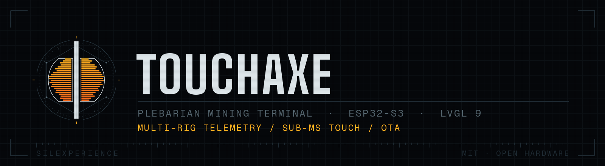
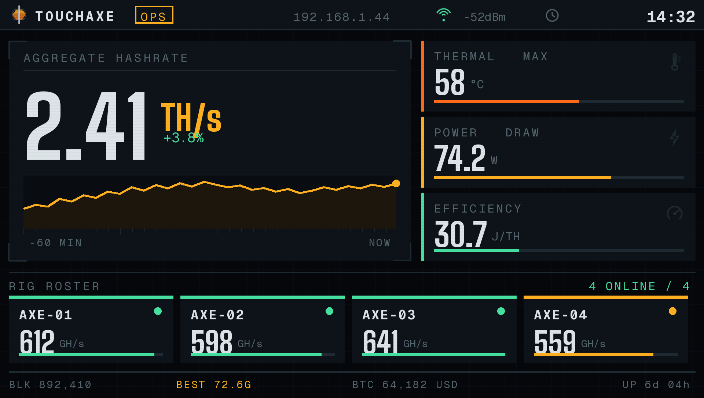
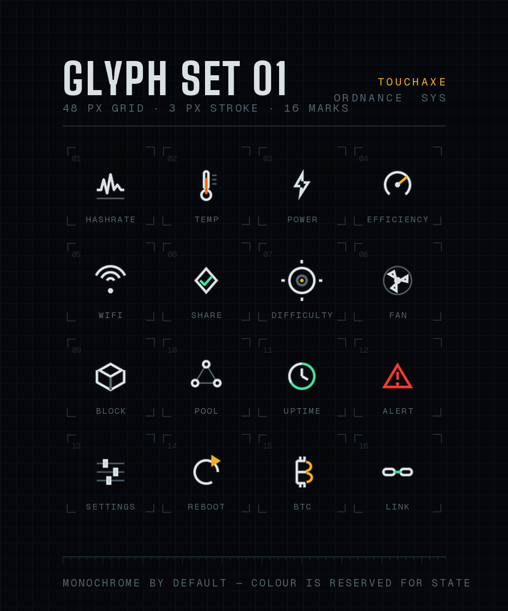

<p align="center">
  
</p>

<p align="center">
  
  
  
  
</p>

**Multi-rig Bitcoin mining telemetry for ESP32-S3 with a 480×272 capacitive touchscreen.**

[Flash online](#-quick-start) · [Architecture](#-architecture) · [Design system](#-design-system) · [Build from source](#️-building-from-source) · [Issues](https://github.com/Silexperience210/TouchAxe/issues)

<p align="center">
  
</p>

---

## 🌟 Features

### 📊 **Real-Time Mining Monitoring**
- **Multi-Miner Support**: Monitor multiple BitAxe ESP-Miners simultaneously
- **Best Difficulty Tracking**: Displays best difficulty in readable format (72.6G, 997.3M, etc.)
- **Power Consumption**: Total power tracking with automatic kW conversion
- **Hashrate Display**: Real-time hashrate monitoring for all connected miners
- **Online Status**: Visual indicators for each miner's connectivity

### ₿ **Bitcoin Price Integration**
- **Live BTC Price**: Real-time Bitcoin price from CoinGecko API
- **Sats Conversion**: Automatic conversion to Satoshis
- **Auto-Refresh**: Updates every 15 seconds

### 🎨 **Sleek User Interface**
- **480×272 Touchscreen**: Full-color capacitive touch display
- **Ultra-Responsive Touch**: <1ms latency with optimized GT911 driver
- **Multiple Screens**: Clock, Miners, Config, WiFi management
- **Professional Design**: Dark theme with orange accents
- **Smooth Animations**: LVGL-powered UI transitions

### ⚙️ **Easy Configuration**
- **WiFi Portal**: Built-in configuration interface
- **Miner Management**: Add/remove miners via web interface
- **Timezone Support**: Automatic time synchronization
- **Persistent Storage**: Settings saved to SPIFFS

### ⚡ **Optimized Performance**
- **ESP32-S3 @ 240MHz**: Maximum CPU speed for smooth operation
- **Debug Level 0**: Optimized for production use
- **Single-Core Stable**: Reliable operation on Core 1
- **Low Memory Footprint**: 44.5% flash, 34.5% RAM usage

---

## 🧭 Architecture

The single most important rule in this codebase:

> **The LVGL thread never performs network I/O.**

Earlier versions polled every rig with synchronous `HTTPClient` calls from an
`lv_timer` callback. Each unreachable miner froze the screen for the request
timeout — four offline rigs meant four seconds of dead touch. That is fixed
structurally, not by tuning timeouts.

```
core 0                                   core 1
┌──────────────────────────┐             ┌──────────────────────────┐
│ telemetry task           │             │ Arduino loop             │
│  · polls every rig       │             │  · lv_timer_handler()    │
│  · drains action queue   │  snapshot   │  · reads snapshot only   │
│  · checks OTA manifest   │ ──────────▶ │  · never blocks          │
│  · WiFi / TCP stack      │  (mutex)    │                          │
└──────────────────────────┘             └──────────────────────────┘
```

| Module | Responsibility |
|---|---|
| `src/telemetry.cpp` | all rig HTTP, snapshot publication, rolling history, action queue |
| `src/ota_manager.cpp` | manifest check + firmware update over HTTPS |
| `include/ordnance_theme.h` | every colour, spacing and type token in the project |
| `src/ui.cpp` | rendering only — reads snapshots, calls no API |

`RigState` is derived in exactly one place (`Telemetry::state()`), so every
screen agrees on what "thermal" or "fault" means.

### Over-the-air updates

The device checks `docs/ota.json` on GitHub Pages every 6 hours from the
telemetry task. Updates are downloaded and applied only when explicitly
triggered, so the screen never goes dark unexpectedly.

---

## 🎨 Design system

The interface follows **ORDNANCE** — a visual system for instruments that must
be read rather than admired. Ten colours, five type roles, square corners, and
one law: *colour encodes machine state, never decoration.*

<p align="center">
  
</p>

Every asset in `assets/brand/` is generated procedurally from geometry — no
stock imagery, no traced sources. The generators live in `tools/design/` and are
deterministic, so the whole system can be re-cut at any resolution:

```bash
pip install pillow
cd tools/design && python brand.py && python screens.py && python icons.py
```

Full rationale, palette table (with RGB565 values) and construction spec:
[`docs/design/ORDNANCE_DESIGN_SYSTEM.md`](docs/design/ORDNANCE_DESIGN_SYSTEM.md).

---

## 🚀 Quick Start

### Option 1: Web Flasher (Easiest)

1. **Visit the installer**: [https://silexperience210.github.io/TouchAxe/](https://silexperience210.github.io/TouchAxe/)
2. **Connect your ESP32-S3** via USB
3. **Click "Install TouchAxe Firmware"**
4. **Select your device** and wait for installation
5. **Done!** Your device will reboot with TouchAxe

> ⚠️ **Requirements**: Chrome, Edge, or Opera browser with Web Serial API support

### Option 2: PlatformIO (Advanced)

```bash
# Clone the repository
git clone https://github.com/Silexperience210/TouchAxe.git
cd TouchAxe

# Install dependencies
pio lib install

# Build and upload
pio run --target upload

# Monitor serial output
pio device monitor
```

---

## 📱 Hardware Requirements

### Required Hardware
- **ESP32-S3** board with 480×272 touchscreen
  - Recommended: **esp32-4827S043C** or compatible
  - 8MB Flash, 8MB PSRAM (QSPI)
- **GT911** capacitive touch controller
- **USB-C** cable for programming

### Supported Displays
- 480×272 IPS LCD with GT911 touch
- TFT_eSPI compatible displays

---

## 🛠️ Building from Source

### Prerequisites
```bash
# Install PlatformIO Core
pip install platformio

# Or use VS Code with PlatformIO extension
```

### Dependencies
All dependencies are automatically managed by PlatformIO:

- **LVGL 9.4.0**: Graphics library
- **TFT_eSPI 2.5.43**: Display driver
- **ArduinoJson 7.0.4**: JSON parsing
- **ESPAsyncWebServer**: Configuration portal
- **arduino-timer 3.0.1**: Task scheduling

### Build Configuration

Edit `platformio.ini` for your setup:

```ini
[env:esp32-4827S043C]
upload_port = COM19  # Change to your port
monitor_speed = 115200

build_flags =
    -D CORE_DEBUG_LEVEL=0
    -D BOARD_HAS_PSRAM
    -D LV_HOR_RES_MAX=480
    -D LV_VER_RES_MAX=272
    -D ARDUINO_RUNNING_CORE=1

board_build.f_cpu = 240000000L
```

### Compile and Upload

```bash
# Build only
pio run

# Build and upload
pio run --target upload

# Upload to specific port
pio run --target upload --upload-port COM19

# Monitor serial output
pio device monitor -b 115200
```

---

## 📖 Configuration

### First Boot Setup

1. **Connect to WiFi**: TouchAxe creates an AP named `TouchAxe-XXXXXX`
2. **Open web portal**: Navigate to `192.168.4.1`
3. **Configure WiFi**: Enter your network credentials
4. **Add Miners**: Input BitAxe IP addresses
5. **Save & Reboot**: Device will connect to your network

### Adding BitAxe Miners

Via Web Interface:
1. Navigate to Config screen (touch Config button)
2. Open web interface at device IP
3. Add miner name and IP address
4. Save configuration

Via Code (optional):
```cpp
// In wifi_manager.cpp
wifiManager.addDevice("Miner1", "192.168.1.100");
wifiManager.addDevice("Miner2", "192.168.1.101");
```

---

## 🎨 Screen Overview

### 1. Clock Screen (Main)
- Current time and date
- Bitcoin price & Sats
- Best difficulty across all miners
- Total power consumption
- Navigation buttons (Miners, Config)

### 2. Miners Screen
- List of all configured miners
- Individual hashrate, status, power
- Online/offline indicators
- Refresh button

### 3. Config Screen
- WiFi settings
- Miner management
- System information
- Factory reset option

### 4. WiFi Portal
- Network scanning
- Manual SSID entry
- Password configuration
- Connection status

---

## 🔧 API Integration

### BitAxe API
TouchAxe polls the BitAxe ESP-Miner API every 15 seconds:

**Endpoint**: `http://<miner-ip>/api/system/info`

**Parsed Fields**:
```json
{
  "power": 14.5,           // Power consumption in Watts
  "hashRate": 563.2,       // Hashrate in GH/s
  "bestDiff": "72.6G",     // Best difficulty (string format)
  "temp": 45.3,            // Temperature in °C
  "sharesAccepted": 1234,  // Accepted shares
  "sharesRejected": 2      // Rejected shares
}
```

### CoinGecko API
Bitcoin price updates every 15 seconds:

**Endpoint**: `https://api.coingecko.com/api/v3/simple/price?ids=bitcoin&vs_currencies=usd`

---

## 📊 Technical Specifications

| Component | Specification |
|-----------|---------------|
| **MCU** | ESP32-S3 (Xtensa LX7 dual-core) |
| **Clock Speed** | 240 MHz |
| **Flash** | 8 MB (QIO mode, 80MHz) |
| **PSRAM** | 8 MB (QSPI) |
| **Display** | 480×272 IPS LCD |
| **Touch** | GT911 capacitive (5-point multi-touch) |
| **WiFi** | 802.11 b/g/n (2.4 GHz) |
| **Framework** | Arduino ESP32 3.20017.241212 |
| **GUI** | LVGL 9.4.0 |
| **Firmware Size** | ~1.5 MB (44.5% of 3.3 MB partition) |
| **RAM Usage** | ~113 KB (34.5% of 328 KB) |

---

## 🐛 Troubleshooting

### Upload Issues
```bash
# If upload fails, manually enter bootloader mode:
# 1. Hold BOOT button
# 2. Press RESET button
# 3. Release RESET
# 4. Release BOOT
# 5. Run upload command
pio run --target upload
```

### Touch Not Responding
- Check I2C connections (SDA/SCL)
- Verify GT911 interrupt pin configuration
- Ensure touch calibration in `touch.cpp`

### WiFi Connection Failed
- Check SSID and password
- Verify 2.4GHz network (5GHz not supported)
- Try factory reset via web portal

### Display Issues
- Verify TFT_eSPI configuration in `User_Setup.h`
- Check SPI pins and frequency
- Ensure correct display driver (ST7796 or compatible)

---

## 🚧 Roadmap

### Shipped in 1.3.0

- [x] Non-blocking telemetry task (UI can no longer freeze on a dead rig)
- [x] Efficiency metric (J/TH)
- [x] Rolling hashrate history for sparklines
- [x] Per-rig state model with thermal / fault detection
- [x] OTA firmware updates
- [x] ORDNANCE design system and token header

### Next

- [ ] Rebuild the main screen on `ox_tile()` and the token header
- [ ] Temperature alerts with on-screen acknowledgement
- [ ] Authentication on the configuration portal
- [ ] MQTT / Home Assistant discovery
- [ ] Multi-language support
- [ ] Unit tests for `Telemetry` state derivation

## 🤝 Contributing

Contributions are welcome! Here's how you can help:

1. **Fork the repository**
2. **Create a feature branch**: `git checkout -b feature/amazing-feature`
3. **Commit your changes**: `git commit -m 'Add amazing feature'`
4. **Push to branch**: `git push origin feature/amazing-feature`
5. **Open a Pull Request**

### Development Guidelines
- Follow existing code style
- Test on real hardware before submitting
- Update documentation for new features
- Keep commits atomic and descriptive

---

## 📄 License

This project is licensed under the **MIT License** - see the [LICENSE](LICENSE) file for details.

```
MIT License

Copyright (c) 2025 Silexperience210

Permission is hereby granted, free of charge, to any person obtaining a copy
of this software and associated documentation files...
```

---

## 🙏 Acknowledgments

- **[LVGL](https://lvgl.io/)**: Excellent embedded graphics library
- **[BitAxe](https://github.com/skot/ESP-Miner)**: Open-source Bitcoin ASIC miner
- **[ESP-IDF](https://github.com/espressif/esp-idf)**: Espressif IoT Development Framework
- **[TFT_eSPI](https://github.com/Bodmer/TFT_eSPI)**: Fast TFT library for ESP32
- **[ESPHome](https://esphome.io/)**: For ESP Web Tools inspiration

---

## 📞 Support

- **GitHub Issues**: [Report bugs](https://github.com/Silexperience210/TouchAxe/issues)
- **Discussions**: [Ask questions](https://github.com/Silexperience210/TouchAxe/discussions)

---

<div align="center">

**Made with ⚡ and ₿ by [Silexperience210](https://github.com/Silexperience210)**

**⚡ Powered by Silexperience ⚡**

If you find this project useful, consider giving it a ⭐!

[](https://github.com/Silexperience210/TouchAxe/stargazers)
[](https://github.com/Silexperience210/TouchAxe/network/members)

</div>
